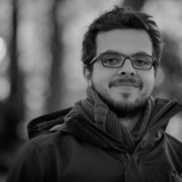

# About

My name is **Juan David Valencia Payan**. I am from **Buga, Colombia**. I am working in The Netherlands as a **PhD Research Scholar** at **Eindhoven University of Technology**. My research project is about "**Mixed-time criticality control systems**".

For the past seven years I have moved to **Poland**, **Brazil**, **Germany** and now **The Netherlands**. I went to Brazil after finishing Bachelors’ in Electronics Engineering. After finishing Masters’ I am currently pursuing PhD with focus on **real-time embedded control systems**. I am passionate about engineering, social work, sports, and meeting new people.

During my free time I **swim, surf, run, bike, read, travel, and play the guitar or the ukulele**.

[Resume](resume)
[Hobbies](hobbies)
[Contact](contact)
