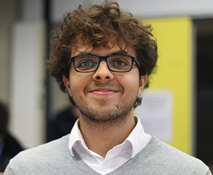

test

# About

Hallo!, I am **Juan David Valencia Payan**. I am from **Buga**, **Colombia**, and I am working in The Netherlands as a **System Engineer** at **Dutch Ophthalmic Research Center** and a **PhD Research Scholar** at **Eindhoven University of Technology**.

For the past seven years I have moved to **Poland**, **Brazil**, **Germany**, where I have been working for my Bachelor's and Master's studies in Electrical Engineering. Right now, I am based in **The Netherlands** where I am pursuing my PhD with focus on **real-time embedded control systems**. I am passionate about engineering, sports, and meeting new people.

During my free time I like to sport (**swimming**, **surfing**, **running**, **cycling**, **playing table tennis**), learn many new things (**reading**, **traveling**, **going to museum workshops**), and be creative (**playing the guitar or the ukulele**, **taking pictures**, **IoT gardening**).

[Resume](resume)
[Hobbies](hobbies)
[Contact](contact)
