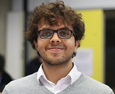

# About

Hallo!, I am **Juan Valencia**. I am from **Buga**, **Colombia**. I am working in The Netherlands as a **System Engineer** with focus on **fluidics control for ophtalmic surgery** at the **Dutch Ophthalmic Research Center** and a **PhD Research Scholar** at **Eindhoven University of Technology** where I am pursuing my PhD with focus on **real-time embedded control systems**.

During my free time I like to be active by sporting (**swimming**, **running**, **cycling**), learning (**reading**, **traveling**, **going to museum workshops**), and being creative (**playing the guitar or the ukulele**, **taking pictures**).

[Resume](resume)
[Hobbies](hobbies)
[Photos](photography)
[Contact](contact)
